# KarmicDD Backend - Complete Low-Level Architecture Diagram

## Files Read and Analyzed:
**Configuration Files (5):**
- `config/db.ts` - Database connections (PostgreSQL + MongoDB)
- `config/jwt.ts` - JWT token generation and verification
- `config/passport.ts` - OAuth strategies (Google, LinkedIn)
- `config/session.ts` - File-based session management
- `config/swagger.ts` - API documentation configuration

**Middleware Files (4):**
- `middleware/auth.ts` - JWT authentication and role authorization
- `middleware/csrf.ts` - CSRF protection and token generation
- `middleware/errorHandler.ts` - Global error handling
- `middleware/security.ts` - Comprehensive security (527 lines) - input sanitization, rate limiting, validation schemas

**Models (15 core models):**
- `models/Profile/StartupProfile.ts` - MongoDB startup profiles
- `models/Profile/Document.ts` - Document management with 50+ document types
- `models/Profile/ExtendedProfile.ts` - Additional profile data
- `models/InvestorModels/InvestorProfile.ts` - MongoDB investor profiles
- `models/Analytics/NewFinancialDueDiligenceReport.ts` - Financial analysis reports
- `models/Analytics/LegalDueDiligenceReport.ts` - Legal analysis reports
- `models/question/QuestionnaireSubmission.ts` - Questionnaire data
- `models/RecommendationModel.ts` - AI-generated recommendations
- And 7 more specialized models

**Controllers (15 controllers):**
- `controllers/authController.ts` - Authentication logic
- `controllers/profileController.ts` - Profile management (952 lines)
- `controllers/NewFinancialDueDiligenceController.ts` - Financial DD analysis (635 lines)
- `controllers/matchingController.ts` - AI-powered matching
- And 11 more specialized controllers

**Services (12 services):**
- `services/MemoryBasedOcrPdfService.ts` - PDF OCR processing (558 lines)
- `services/NewFinancialDueDiligenceService.ts` - Financial analysis (421 lines)
- `services/MLMatchingService.ts` - AI matching algorithms (645 lines)
- `services/RecommendationService.ts` - AI recommendations (485 lines)
- And 8 more specialized services

The system follows a data flow of **Routes → Controllers → Services**.

| Service | Purpose | Associated Routes |
| :--- | :--- | :--- |
| **Authentication Service** | Handles user registration, login, OAuth (Google, LinkedIn), and role management. | `/api/auth/*` |
| **Profile Service** | Manages CRUD operations for startup and investor profiles, including extended profile data and sharing functionality. | `/api/profile/*`, `/api/users/*` |
| **MLMatchingService** | Performs AI-powered matching between startups and investors, calculating compatibility scores and analyzing value alignment. | `/api/matching/*` |
| **Compatibility Service** | Provides detailed compatibility analysis, score breakdowns, and insights for potential matches. | `/api/score/*` |
| **RecommendationService** | Generates personalized recommendations and strategic insights for users using AI. | `/api/recommendations/*` |
| **NewFinancialDueDiligenceService** | Uses OCR and AI to process financial documents, generate reports, and perform risk assessments. | `/api/new-financial/*` |
| **NewLegalDueDiligenceService** | Analyzes legal documents for compliance, risks, and generates legal insights. | `/api/legal-due-diligence/*` |
| **Document Processing Services** | A collection of services that handle document upload, OCR, content extraction, and categorization. Used by various controllers like `ProfileController`. | (Used by other services, e.g., Financial/Legal DD) |
| **Questionnaire Service** | Analyzes and processes user questionnaire submissions to enhance matching and compatibility scoring. | `/api/questionnaire/*` |
| **Belief System Service** | Analyzes value alignment and cultural fit between entities. | `/api/analysis/*` |
| **Search Service** | Provides advanced search and filtering capabilities across the platform. | `/api/search/*` |
| **Email Service** | Manages sending all transactional emails, notifications, and match alerts. | `/api/email/*` |
| **Analytics & Monitoring Services** | Includes services for tracking API usage, performance metrics, security events, and dashboard data. | `/api/stats`, `/api/analytics/*` |
| **Task Service** | Manages background jobs, processing tasks, and status tracking. | `/api/tasks/*` |

**Utilities (12 utility modules):**
- `utils/logger.ts` - Advanced logging system (241 lines)
- `utils/validation.ts` - Comprehensive validation (457 lines)
- `utils/fileUtils.ts` - File operations
- `utils/security.ts` - Security utilities
- `utils/logs.ts` - Request tracking and performance monitoring (261 lines)
- `utils/asyncHandler.ts` - Promise-based error handling wrapper
- `utils/passwordUtils.ts` - bcrypt password hashing (12 salt rounds)
- `utils/sanitization.ts` - Input sanitization utilities
- `utils/tokenCounter.ts` - API token counting
- `utils/fileLogger.ts` - File-based logging
- `utils/jsonHelper.ts` - JSON manipulation utilities
- `utils/geminiPrompts.ts` & `utils/geminiApiHelper.ts` - AI API integrations

**Routes (16 route groups):**
- Authentication, Profile, Matching, Financial DD, Legal DD, Analytics, etc.

## 1. System Overview and Entry Points

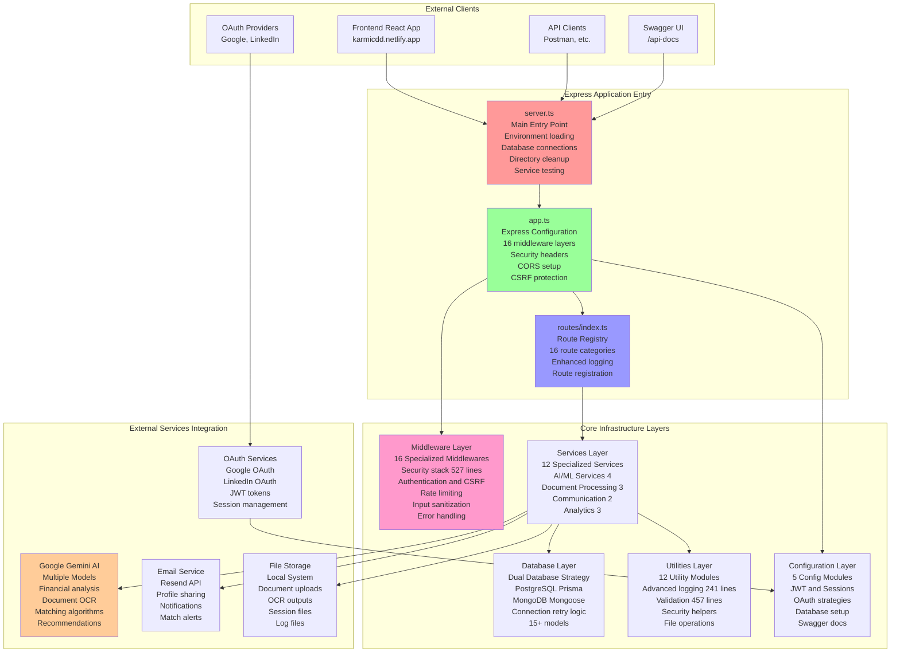
## 2. Server Startup Flow (server.ts)

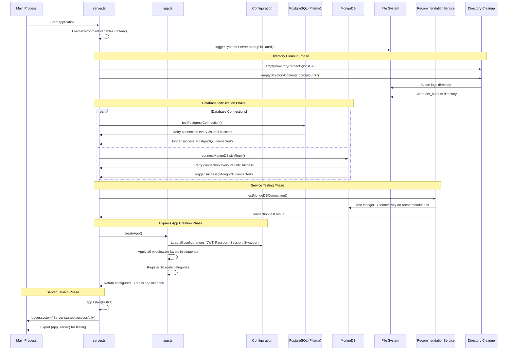

## 3. Express App Configuration Flow (app.ts)

```mermaid
graph TD
    subgraph "Express App Creation Flow"
        START["createApp()"]
        
        subgraph "Security Middleware (First)"
            SEC_HEADERS[securityHeaders]
            HELMET[helmet configuration]
            RATE_LIMIT[generalRateLimit]
            SANITIZE[sanitizeInput]
            MONGO_SANITIZE[mongoSanitizeMiddleware]
        end
        
        subgraph "Body Parsing & Session"
            JSON_PARSER["express.json limit:10mb"]
            URL_PARSER["express.urlencoded limit:2mb"]
            COOKIE_PARSER[cookieParser]
            SESSION[session configuration]
        end
        
        subgraph "CORS Configuration"
            CORS_SETUP[Dynamic CORS origin check]
            CORS_ORIGINS["Allowed Origins:<br/>- karmicdd.netlify.app<br/>- localhost:5173<br/>- localhost:3000<br/>- 127.0.0.1:5173"]
        end
        
        subgraph "CSRF Protection"
            CSRF_MIDDLEWARE[csrfProtection]
            CSRF_ENDPOINT["/api/csrf-token endpoint"]
            CSRF_RATE_LIMIT[csrfTokenRateLimit]
        end
        
        subgraph "Custom Middleware"
            COUNT_REQ[countRequest]
            TRACK_TIME[trackTime]
        end
        
        subgraph "Documentation & Routes"
            SWAGGER_SETUP["Swagger UI /api-docs"]
            API_ROUTES["API Routes /api"]
            TEST_ENDPOINT["Test endpoint /api/test"]
            STATS_ENDPOINT["Stats endpoint /api/stats"]
            ROOT_ENDPOINT["Root endpoint /"]
        end
        
        ERROR_HANDLER[errorHandler middleware]
        
        START --> SEC_HEADERS
        SEC_HEADERS --> HELMET
        HELMET --> RATE_LIMIT
        RATE_LIMIT --> SANITIZE
        SANITIZE --> MONGO_SANITIZE
        MONGO_SANITIZE --> JSON_PARSER
        JSON_PARSER --> URL_PARSER
        URL_PARSER --> COOKIE_PARSER
        COOKIE_PARSER --> SESSION
        SESSION --> CORS_SETUP
        CORS_SETUP --> CSRF_MIDDLEWARE
        CSRF_MIDDLEWARE --> CSRF_ENDPOINT
        CSRF_ENDPOINT --> COUNT_REQ
        COUNT_REQ --> TRACK_TIME
        TRACK_TIME --> SWAGGER_SETUP
        SWAGGER_SETUP --> API_ROUTES
        API_ROUTES --> TEST_ENDPOINT
        TEST_ENDPOINT --> STATS_ENDPOINT
        STATS_ENDPOINT --> ROOT_ENDPOINT
        ROOT_ENDPOINT --> ERROR_HANDLER
    end
    
    style START fill:#ff9999
    style ERROR_HANDLER fill:#99ff99
```

## 4. Database Architecture

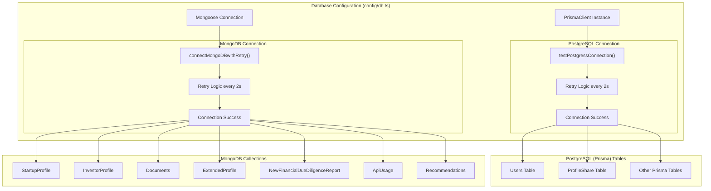

## 5. Authentication & Authorization Complete Flow

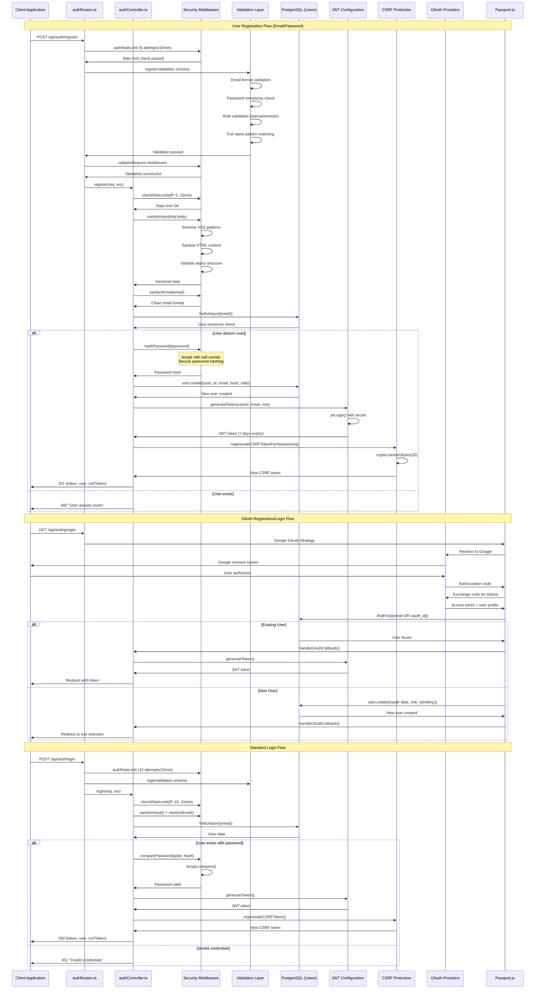

## 6. JWT Configuration & Session Management Detail

```mermaid
graph TD
    subgraph "JWT Configuration (config/jwt.ts)"
        JWT_CONFIG["JWT Configuration<br/>• JWT_SECRET from env<br/>• JWT_EXPIRES_IN (7 days)<br/>• Fallback secret handling<br/>• Type-safe interfaces"]
        
        JWT_GENERATE["generateToken Function<br/>• userId (UUID)<br/>• email (string)<br/>• role (startup/investor)<br/>• jwt.sign() with secret<br/>• No expiration set (7d default)"]
        
        JWT_VERIFY["verifyToken Function<br/>• Token validation<br/>• jwt.verify() with secret<br/>• Error handling<br/>• Returns decoded payload"]
    end
    
    subgraph "Session Configuration (config/session.ts)"
        SESSION_STORE["File-Based Session Store<br/>• SessionFileStore implementation<br/>• /sessions directory<br/>• 24-hour TTL<br/>• Automatic cleanup"]
        
        SESSION_CONFIG["Session Configuration<br/>• Secret from environment<br/>• SameSite policy (none/lax)<br/>• Secure cookies (HTTPS)<br/>• HttpOnly protection<br/>• Domain settings"]
        
        SESSION_OPTIONS["Session Options<br/>• resave: false<br/>• saveUninitialized: false<br/>• maxAge: 24 hours<br/>• Custom session name"]
    end
    
    subgraph "OAuth Configuration (config/passport.ts)"
        GOOGLE_STRATEGY["Google OAuth Strategy<br/>• Client ID/Secret from env<br/>• Callback URL configuration<br/>• Profile + email scopes<br/>• User creation/lookup logic"]
        
        LINKEDIN_STRATEGY["LinkedIn OAuth Strategy<br/>• Client credentials<br/>• API URL configuration<br/>• Profile data extraction<br/>• Email verification"]
        
        PASSPORT_SERIALIZATION["Passport Serialization<br/>• serializeUser by user_id<br/>• deserializeUser from database<br/>• User interface transformation<br/>• Error handling"]
    end
    
    subgraph "CSRF Protection (middleware/csrf.ts)"
        CSRF_GENERATION["CSRF Token Generation<br/>• crypto.randomBytes(32)<br/>• Hex string conversion<br/>• Session storage<br/>• Token validation"]
        
        CSRF_MIDDLEWARE["CSRF Protection Middleware<br/>• Skip GET/HEAD/OPTIONS<br/>• Skip OAuth endpoints<br/>• Header/body token check<br/>• Security event logging"]
        
        CSRF_ENDPOINT["CSRF Token Endpoint<br/>• /api/csrf-token<br/>• Rate limited (30/min)<br/>• Session-based generation<br/>• JSON response"]
    end
    
    JWT_CONFIG --> JWT_GENERATE
    JWT_CONFIG --> JWT_VERIFY
    
    SESSION_STORE --> SESSION_CONFIG
    SESSION_CONFIG --> SESSION_OPTIONS
    
    GOOGLE_STRATEGY --> PASSPORT_SERIALIZATION
    LINKEDIN_STRATEGY --> PASSPORT_SERIALIZATION
    
    CSRF_GENERATION --> CSRF_MIDDLEWARE
    CSRF_MIDDLEWARE --> CSRF_ENDPOINT
    
    style JWT_CONFIG fill:#ff9999
    style SESSION_STORE fill:#99ff99
    style GOOGLE_STRATEGY fill:#9999ff
    style CSRF_GENERATION fill:#ffcc99
```

## 7. Security Middleware Architecture (527 lines)

```mermaid
graph TD
    subgraph "Input Security & Sanitization"
        SANITIZE_INPUT["sanitizeInput Middleware<br/>• Body size validation (2MB)<br/>• Suspicious pattern detection<br/>• XSS prevention<br/>• Recursive object sanitization<br/>• DOMPurify integration"]
        
        MONGO_SANITIZE["mongoSanitizeMiddleware<br/>• NoSQL injection prevention<br/>• Key replacement with '_'<br/>• Security event logging<br/>• Malicious query blocking"]
        
        PATTERN_DETECTION["Suspicious Pattern Detection<br/>• Script tag removal<br/>• JavaScript: URL blocking<br/>• Event handler removal<br/>• Template injection prevention<br/>• CSS expression blocking"]
        
        SANITIZE_OBJECT["Object Sanitization<br/>• Recursive processing<br/>• String sanitization<br/>• Array handling<br/>• Key sanitization<br/>• Type preservation"]
    end
    
    subgraph "Rate Limiting Strategy"
        GENERAL_RATE["generalRateLimit<br/>• 100 requests/15min<br/>• IP-based limiting<br/>• Standard headers<br/>• Legacy header disable"]
        
        AUTH_RATE["authRateLimit<br/>• 5 attempts/15min<br/>• Authentication protection<br/>• Extended timeout<br/>• Brute force prevention"]
        
        UPLOAD_RATE["uploadRateLimit<br/>• 10 uploads/hour<br/>• File upload protection<br/>• Large payload prevention<br/>• Resource abuse protection"]
        
        CSRF_RATE["csrfTokenRateLimit<br/>• 30 requests/minute<br/>• Token endpoint protection<br/>• Rapid request prevention<br/>• API abuse mitigation"]
        
        EMAIL_RATE["emailRateLimit<br/>• 5 emails/hour<br/>• Communication limiting<br/>• Spam prevention<br/>• Service protection"]
        
        CUSTOM_RATE["Custom Rate Limiting<br/>• checkRateLimit utility<br/>• Memory-based storage<br/>• Configurable windows<br/>• IP tracking"]
    end
    
    subgraph "File Upload Security"
        FILE_VALIDATION["validateFileUpload<br/>• File type validation<br/>• Size limit enforcement<br/>• MIME type verification<br/>• Extension matching"]
        
        ALLOWED_TYPES["Allowed File Types<br/>• PDF documents<br/>• Office files (doc, xls, ppt)<br/>• Images (jpg, png, gif)<br/>• Text files (txt, md, csv)"]
        
        SECURITY_CHECKS["Security Checks<br/>• Suspicious filename detection<br/>• Executable file blocking<br/>• Script file prevention<br/>• MIME/extension mismatch"]
        
        SIZE_LIMITS["Size Limitations<br/>• 10MB default maximum<br/>• Configurable per endpoint<br/>• Memory usage protection<br/>• Storage optimization"]
    end
    
    subgraph "Security Headers & CSP"
        SECURITY_HEADERS["securityHeaders Middleware<br/>• Content Security Policy<br/>• XSS Protection<br/>• Frame Options<br/>• Content Type Options"]
        
        CSP_DIRECTIVES["CSP Configuration<br/>• Environment-based policies<br/>• Script source restrictions<br/>• Style source limitations<br/>• Font and image policies"]
        
        PROTECTION_HEADERS["Protection Headers<br/>• X-Content-Type-Options: nosniff<br/>• X-Frame-Options: DENY<br/>• X-XSS-Protection: 1; mode=block<br/>• Referrer-Policy: strict-origin"]
        
        HSTS_CONFIG["HSTS Configuration<br/>• max-age: 31536000<br/>• includeSubDomains<br/>• preload directive<br/>• HTTPS enforcement"]
    end
    
    subgraph "Validation Schemas"
        USER_VALIDATION["User Validation Schemas<br/>• Registration validation<br/>• Login validation<br/>• Role update validation<br/>• Email normalization"]
        
        PROFILE_VALIDATION["Profile Validation<br/>• Startup profile schema<br/>• Investor profile schema<br/>• Extended profile validation<br/>• Field length limits"]
        
        DOCUMENT_VALIDATION["Document Validation<br/>• Metadata validation<br/>• Description limits<br/>• Type categorization<br/>• Time period formatting"]
        
        FIELD_VALIDATION["Field-Specific Validation<br/>• Email format validation<br/>• Password complexity<br/>• URL validation<br/>• Pattern matching"]
    end
    
    SANITIZE_INPUT --> PATTERN_DETECTION
    PATTERN_DETECTION --> SANITIZE_OBJECT
    SANITIZE_INPUT --> MONGO_SANITIZE
    
    GENERAL_RATE --> AUTH_RATE
    AUTH_RATE --> UPLOAD_RATE
    UPLOAD_RATE --> CSRF_RATE
    CSRF_RATE --> EMAIL_RATE
    EMAIL_RATE --> CUSTOM_RATE
    
    FILE_VALIDATION --> ALLOWED_TYPES
    ALLOWED_TYPES --> SECURITY_CHECKS
    SECURITY_CHECKS --> SIZE_LIMITS
    
    SECURITY_HEADERS --> CSP_DIRECTIVES
    CSP_DIRECTIVES --> PROTECTION_HEADERS
    PROTECTION_HEADERS --> HSTS_CONFIG
    
    USER_VALIDATION --> PROFILE_VALIDATION
    PROFILE_VALIDATION --> DOCUMENT_VALIDATION
    DOCUMENT_VALIDATION --> FIELD_VALIDATION
    
    style SANITIZE_INPUT fill:#ff9999
    style GENERAL_RATE fill:#99ff99
    style FILE_VALIDATION fill:#9999ff
    style SECURITY_HEADERS fill:#ffcc99
    style USER_VALIDATION fill:#ff99cc
```

## 8. Complete Route Architecture (16 Route Categories)

```mermaid
graph TD
    subgraph "Main Router Architecture (routes/index.ts)"
        MAIN_ROUTER["Main Express Router<br/>• Route registration logging<br/>• Enhanced middleware<br/>• Category organization<br/>• Error handling"]
        
        subgraph "Authentication Routes (/api/auth)"
            AUTH_ROUTES["authRoutes.ts<br/>• passport.initialize()<br/>• Enhanced validation<br/>• Rate limiting<br/>• CSRF protection"]
            
            AUTH_ENDPOINTS["Authentication Endpoints<br/>• POST /register<br/>• POST /login<br/>• POST /update-role<br/>• GET /google<br/>• GET /linkedin<br/>• GET /google/callback<br/>• GET /linkedin/callback"]
            
            AUTH_MIDDLEWARE["Auth Middleware Stack<br/>• authRateLimit<br/>• registerValidation<br/>• loginValidation<br/>• validateRequest"]
        end
        
        subgraph "User Management (/api/users, /api/profile)"
            USER_ROUTES["userRoutes.ts<br/>• User management<br/>• Profile operations<br/>• Data retrieval<br/>• Account settings"]
            
            PROFILE_ROUTES["profileRoutes.ts<br/>• Profile CRUD operations<br/>• Extended profiles<br/>• Share functionality<br/>• Privacy settings"]
            
            PROFILE_ENDPOINTS["Profile Endpoints<br/>• GET /user-type<br/>• POST /startup<br/>• POST /investor<br/>• GET /startup<br/>• GET /investor<br/>• POST /extended<br/>• POST /share<br/>• GET /shared/:token"]
        end
        
        subgraph "Matching System (/api/matching, /api/score)"
            MATCHING_ROUTES["matchingRoutes.ts<br/>• AI-powered matching<br/>• Match algorithms<br/>• Score calculation<br/>• Match filtering"]
            
            COMPAT_ROUTES["compatibilityControllerRoutes.ts<br/>• Compatibility analysis<br/>• Score breakdown<br/>• Match insights<br/>• Algorithm optimization"]
            
            QUESTIONNAIRE_ROUTES["questionnaireRoute.ts<br/>• Questionnaire submission<br/>• Response processing<br/>• Analysis integration<br/>• Match enhancement"]
            
            BELIEF_ROUTES["BelifSystemRoutes.ts<br/>• Belief system analysis<br/>• Value alignment<br/>• Cultural fit assessment<br/>• Compatibility factors"]
        end
        
        subgraph "Due Diligence System"
            FINANCIAL_DD["Financial DD Routes<br/>• /api/financial (legacy)<br/>• /api/new-financial (enhanced)<br/>• Entity analysis<br/>• Document processing"]
            
            LEGAL_DD["Legal DD Routes<br/>• /api/legal-due-diligence<br/>• Legal analysis<br/>• Compliance checking<br/>• Risk assessment"]
            
            DD_ENDPOINTS["DD Endpoints<br/>• GET /:entityId/analyze<br/>• POST /:entityId/generate<br/>• GET /:entityId<br/>• GET /:entityId/documents<br/>• GET /:entityId/check-documents"]
        end
        
        subgraph "Analytics & Intelligence"
            RECOMMENDATIONS["recommendationRoutes.ts<br/>• AI recommendations<br/>• Personalized insights<br/>• Match suggestions<br/>• Strategic advice"]
            
            ANALYTICS["analyticsRoutes.ts<br/>• Usage analytics<br/>• Performance metrics<br/>• User behavior<br/>• System statistics"]
            
            DASHBOARD["dashboardRoutes.ts<br/>• Dashboard data<br/>• Summary statistics<br/>• Real-time metrics<br/>• KPI tracking"]
        end
        
        subgraph "Utility Routes"
            EMAIL_ROUTES["emailRoutes.ts<br/>• Email sending<br/>• Notification system<br/>• Communication tools<br/>• Template management"]
            
            SEARCH_ROUTES["searchRoutes.ts<br/>• Search functionality<br/>• Filter options<br/>• Query processing<br/>• Result optimization"]
            
            TASK_ROUTES["taskRoutes.ts<br/>• Task management<br/>• Background processing<br/>• Job scheduling<br/>• Status tracking"]
        end
    end
    
    MAIN_ROUTER --> AUTH_ROUTES
    MAIN_ROUTER --> USER_ROUTES
    MAIN_ROUTER --> PROFILE_ROUTES
    MAIN_ROUTER --> MATCHING_ROUTES
    MAIN_ROUTER --> COMPAT_ROUTES
    MAIN_ROUTER --> QUESTIONNAIRE_ROUTES
    MAIN_ROUTER --> BELIEF_ROUTES
    MAIN_ROUTER --> FINANCIAL_DD
    MAIN_ROUTER --> LEGAL_DD
    MAIN_ROUTER --> RECOMMENDATIONS
    MAIN_ROUTER --> ANALYTICS
    MAIN_ROUTER --> DASHBOARD
    MAIN_ROUTER --> EMAIL_ROUTES
    MAIN_ROUTER --> SEARCH_ROUTES
    MAIN_ROUTER --> TASK_ROUTES
    
    AUTH_ROUTES --> AUTH_ENDPOINTS
    AUTH_ROUTES --> AUTH_MIDDLEWARE
    
    PROFILE_ROUTES --> PROFILE_ENDPOINTS
    
    FINANCIAL_DD --> DD_ENDPOINTS
    LEGAL_DD --> DD_ENDPOINTS
    
    style MAIN_ROUTER fill:#ff9999
    style FINANCIAL_DD fill:#99ff99
    style MATCHING_ROUTES fill:#9999ff
    style ANALYTICS fill:#ffcc99
```

## 9. Service Layer Architecture (12 Specialized Services)

```mermaid
graph TB
    subgraph "AI & Machine Learning Services"
        ML_MATCHING["MLMatchingService.ts (645 lines)<br/>• Startup-investor matching<br/>• Score calculation algorithms<br/>• Industry compatibility<br/>• Value alignment analysis<br/>• Gemini AI integration"]
        
        RECOMMENDATION["RecommendationService.ts (485 lines)<br/>• Personalized recommendations<br/>• Strategic insights generation<br/>• MongoDB connection testing<br/>• Cache management<br/>• AI-powered analysis"]
        
        AI_INSIGHTS["AIInsightsService.ts<br/>• Business insights<br/>• Market analysis<br/>• Trend identification<br/>• Performance predictions<br/>• Data-driven recommendations"]
        
        QUESTIONNAIRE_MATCHER["questionnaireMatcher.ts<br/>• Response analysis<br/>• Pattern matching<br/>• Compatibility scoring<br/>• Behavioral insights<br/>• Match enhancement"]
    end
    
    subgraph "Document Processing Services"
        OCR_SERVICE["MemoryBasedOcrPdfService.ts (558 lines)<br/>• PDF combination & splitting<br/>• Memory-based processing<br/>• Gemini OCR integration<br/>• Batch processing<br/>• Error handling & retry logic"]
        
        DOC_PROCESSING["DocumentProcessingService.ts<br/>• Document analysis<br/>• Content extraction<br/>• Metadata processing<br/>• Format conversion<br/>• Quality validation"]
        
        ENHANCED_DOC["EnhancedDocumentProcessingService.ts<br/>• Advanced document analysis<br/>• Multi-format support<br/>• Content intelligence<br/>• Automated categorization<br/>• Processing optimization"]
        
        DOC_AUDIT["DocumentProcessingAuditService.ts<br/>• Processing audit trails<br/>• Quality assurance<br/>• Error tracking<br/>• Performance monitoring<br/>• Compliance checking"]
    end
    
    subgraph "Due Diligence Services"
        NEW_FINANCIAL_DD["NewFinancialDueDiligenceService.ts (421 lines)<br/>• Memory-based OCR processing<br/>• Gemini AI analysis<br/>• Financial report generation<br/>• Risk assessment<br/>• JSON response handling"]
        
        NEW_LEGAL_DD["NewLegalDueDiligenceService.ts<br/>• Legal document analysis<br/>• Compliance verification<br/>• Risk identification<br/>• Regulatory assessment<br/>• Legal insight generation"]
        
        TIME_SERIES["TimeSeriesDataService.ts<br/>• Historical data analysis<br/>• Trend identification<br/>• Performance tracking<br/>• Predictive analytics<br/>• Data visualization support"]
    end
    
    subgraph "Communication & Monitoring"
        EMAIL_SERVICE["emailService.ts<br/>• Email sending functionality<br/>• Template management<br/>• Notification system<br/>• Delivery tracking<br/>• Error handling"]
        
        SECURITY_MONITORING["securityMonitoring.ts<br/>• Security event tracking<br/>• Threat detection<br/>• Anomaly identification<br/>• Alert generation<br/>• Incident response"]
    end
    
    subgraph "Service Dependencies & Integration"
        GEMINI_INTEGRATION["Gemini AI Integration<br/>• Multiple model support<br/>• Financial analysis model<br/>• Document extraction model<br/>• Recommendation model<br/>• Error handling & retries"]
        
        MONGODB_INTEGRATION["MongoDB Integration<br/>• Connection management<br/>• Model operations<br/>• Query optimization<br/>• Data validation<br/>• Error handling"]
        
        FILE_SYSTEM["File System Integration<br/>• Upload management<br/>• Storage optimization<br/>• Directory organization<br/>• Cleanup operations<br/>• Access control"]
        
        EXTERNAL_APIS["External API Integration<br/>• Email service APIs<br/>• OAuth providers<br/>• Third-party services<br/>• Rate limiting<br/>• Error recovery"]
    end
    
    ML_MATCHING --> GEMINI_INTEGRATION
    RECOMMENDATION --> MONGODB_INTEGRATION
    AI_INSIGHTS --> GEMINI_INTEGRATION
    QUESTIONNAIRE_MATCHER --> MONGODB_INTEGRATION
    
    OCR_SERVICE --> GEMINI_INTEGRATION
    OCR_SERVICE --> FILE_SYSTEM
    DOC_PROCESSING --> FILE_SYSTEM
    ENHANCED_DOC --> FILE_SYSTEM
    DOC_AUDIT --> MONGODB_INTEGRATION
    
    NEW_FINANCIAL_DD --> OCR_SERVICE
    NEW_FINANCIAL_DD --> GEMINI_INTEGRATION
    NEW_LEGAL_DD --> OCR_SERVICE
    TIME_SERIES --> MONGODB_INTEGRATION
    
    EMAIL_SERVICE --> EXTERNAL_APIS
    SECURITY_MONITORING --> MONGODB_INTEGRATION
    
    style ML_MATCHING fill:#ff9999
    style OCR_SERVICE fill:#99ff99
    style NEW_FINANCIAL_DD fill:#9999ff
    style EMAIL_SERVICE fill:#ffcc99
```

## 10. MongoDB Model Architecture (15+ Models)

```mermaid
graph TB
    subgraph "Profile Models"
        STARTUP_PROFILE["StartupProfile Model<br/>• userId (indexed, unique)<br/>• companyName<br/>• industry (indexed)<br/>• fundingStage (indexed)<br/>• employeeCount<br/>• location<br/>• pitch<br/>• timestamps"]
        
        INVESTOR_PROFILE["InvestorProfile Model<br/>• userId (indexed, unique)<br/>• companyName<br/>• industriesOfInterest<br/>• preferredStages<br/>• ticketSize<br/>• investmentCriteria<br/>• pastInvestments<br/>• timestamps"]
        
        EXTENDED_PROFILE["ExtendedProfile Model<br/>• userId (indexed)<br/>• avatarUrl<br/>• socialLinks<br/>• teamMembers<br/>• investmentHistory<br/>• bio<br/>• timestamps"]
    end
    
    subgraph "Document Management"
        DOCUMENT_MODEL["Document Model<br/>• userId (indexed)<br/>• fileName, originalName<br/>• fileType, fileSize, filePath<br/>• documentType (50+ types)<br/>• category (financial/legal/other)<br/>• timePeriod<br/>• isPublic<br/>• description<br/>• timestamps"]
        
        DOCUMENT_TYPES["Document Types (50+)<br/>Financial Types:<br/>• financial_balance_sheet<br/>• financial_income_statement<br/>• financial_cash_flow<br/>• financial_tax_returns<br/>Legal Types:<br/>• legal_incorporation_certificate<br/>• legal_moa_aoa<br/>• legal_board_resolutions<br/>General Types:<br/>• pitch_deck<br/>• other, miscellaneous"]
    end
    
    subgraph "Analytics & Reports"
        FINANCIAL_REPORT["NewFinancialDueDiligenceReport<br/>• targetEntityId (indexed)<br/>• targetEntityType<br/>• requestedById<br/>• companyName<br/>• reportDate<br/>• generatedBy<br/>• introduction<br/>• items (analysis array)<br/>• missingDocuments<br/>• riskScore<br/>• availableDocuments<br/>• status<br/>• expiresAt (30 days)"]
        
        LEGAL_REPORT["LegalDueDiligenceReport<br/>• Similar structure to Financial<br/>• Legal-specific analysis<br/>• Compliance assessments<br/>• Risk evaluations<br/>• Regulatory compliance<br/>• Legal recommendations"]
        
        MATCH_ANALYSIS["MatchAnalysis Schema<br/>• startupId, investorId<br/>• matchScore<br/>• breakdown details<br/>• insights array<br/>• algorithmVersion<br/>• calculation metadata"]
    end
    
    subgraph "User Interaction Models"
        QUESTIONNAIRE["QuestionnaireSubmission<br/>• userId (indexed)<br/>• userRole (startup/investor)<br/>• responses (Map structure)<br/>• status (draft/submitted)<br/>• submissionDate<br/>• analysisResults<br/>• completionPercentage"]
        
        RECOMMENDATION_MODEL["Recommendation Model<br/>• startupId, investorId<br/>• perspective (startup/investor)<br/>• recommendations array<br/>• precision score<br/>• createdAt<br/>• expiresAt<br/>• category classifications"]
        
        BELIEF_SYSTEM["BeliefSystemAnalysis<br/>• userId<br/>• analysisResults<br/>• valueAlignment<br/>• culturalFit<br/>• workStylePreferences<br/>• communicationStyle"]
    end
    
    subgraph "System Models"
        API_USAGE["ApiUsage Model<br/>• userId<br/>• endpoint<br/>• requestCount<br/>• responseTime<br/>• lastAccessed<br/>• errorCount<br/>• usage patterns"]
        
        TASK_MODEL["Task Model<br/>• userId<br/>• taskType<br/>• status<br/>• priority<br/>• scheduledAt<br/>• completedAt<br/>• result<br/>• error details"]
        
        TASK_CACHE["TaskVerificationCache<br/>• taskId<br/>• verificationData<br/>• status<br/>• expiresAt<br/>• metadata"]
        
        AI_CACHE["AIInsightCache<br/>• queryHash<br/>• insightData<br/>• generatedAt<br/>• expiresAt<br/>• usage count"]
        
        FORM_SUBMISSION["FormSubmission<br/>• userId<br/>• formType<br/>• formData<br/>• submissionDate<br/>• processedAt<br/>• status"]
    end
    
    subgraph "Model Relationships & Indexing"
        INDEXES["Database Indexes<br/>• userId indexes on all models<br/>• Compound indexes for queries<br/>• Text indexes for search<br/>• TTL indexes for expiration<br/>• Performance optimization"]
        
        RELATIONSHIPS["Model Relationships<br/>• userId references across models<br/>• Profile ↔ Document linkage<br/>• Report ↔ Document association<br/>• Match ↔ Profile connections<br/>• Cross-collection queries"]
    end
    
    STARTUP_PROFILE --> DOCUMENT_MODEL
    INVESTOR_PROFILE --> DOCUMENT_MODEL
    EXTENDED_PROFILE --> STARTUP_PROFILE
    EXTENDED_PROFILE --> INVESTOR_PROFILE
    
    DOCUMENT_MODEL --> DOCUMENT_TYPES
    DOCUMENT_MODEL --> FINANCIAL_REPORT
    DOCUMENT_MODEL --> LEGAL_REPORT
    
    QUESTIONNAIRE --> MATCH_ANALYSIS
    QUESTIONNAIRE --> RECOMMENDATION_MODEL
    BELIEF_SYSTEM --> MATCH_ANALYSIS
    
    API_USAGE --> TASK_MODEL
    TASK_MODEL --> TASK_CACHE
    AI_CACHE --> RECOMMENDATION_MODEL
    
    INDEXES --> RELATIONSHIPS
    
    style DOCUMENT_MODEL fill:#ff9999
    style FINANCIAL_REPORT fill:#99ff99
    style QUESTIONNAIRE fill:#9999ff
    style API_USAGE fill:#ffcc99
```

## 11. Complete User Journey: Registration → Profile → Documents → Financial Analysis

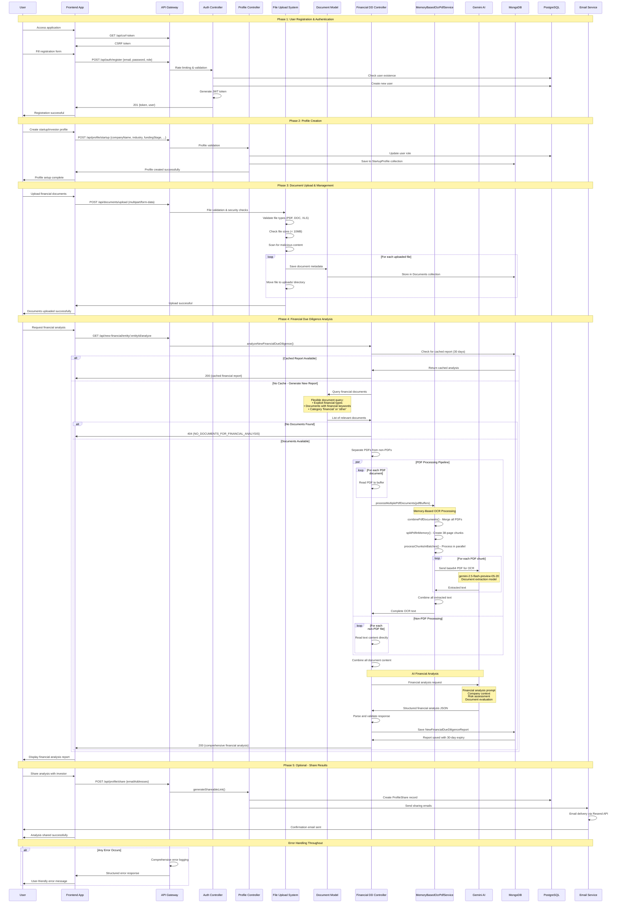

## 12. Error Handling & Logging Architecture

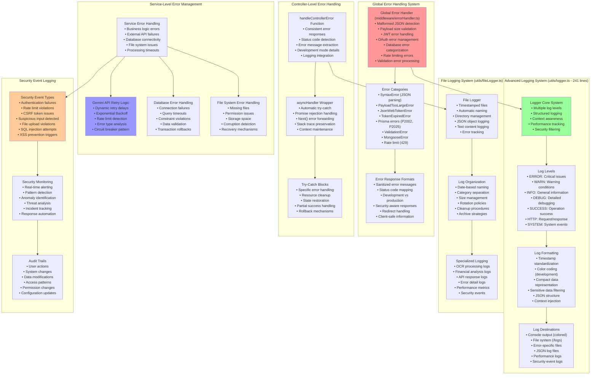

## 13. Performance & Optimization Architecture

```mermaid
graph TD
    subgraph "Request Performance Monitoring"
        TRACK_TIME["trackTime Middleware<br/>- Response time measurement<br/>- Performance metrics<br/>- Slow query detection<br/>- Optimization data<br/>- Bottleneck identification"]
        
        COUNT_REQ["countRequest Middleware<br/>- Request counting<br/>- Endpoint usage tracking<br/>- Traffic analysis<br/>- Load monitoring<br/>- Capacity planning"]
        
        STATS_ENDPOINT["Statistics Endpoint<br/>- /api/stats<br/>- Real-time metrics<br/>- Performance summaries<br/>- Usage analytics<br/>- System health indicators"]
    end
    
    subgraph "Database Optimization"
        MONGO_INDEXES["MongoDB Indexing Strategy<br/>• userId indexes on all collections<br/>• Compound indexes for queries<br/>• Text indexes for search<br/>• TTL indexes for auto-cleanup<br/>• Performance monitoring"]
        
        QUERY_OPTIMIZATION["Query Optimization<br/>• Efficient query patterns<br/>• Aggregation pipelines<br/>• Projection optimization<br/>• Limit and pagination<br/>• Connection pooling"]
        
        CACHE_STRATEGY["Caching Strategy<br/>• Financial DD reports (30 days)<br/>• Recommendation caching<br/>• Match analysis caching<br/>• API response caching<br/>• Session-based caching"]
    end
    
    subgraph "Memory Management"
        MEMORY_OCR["Memory-Based OCR<br/>• In-memory PDF processing<br/>• Buffer management<br/>• Garbage collection<br/>• Memory leak prevention<br/>• Resource optimization"]
        
        BATCH_PROCESSING["Batch Processing<br/>• Chunk-based OCR<br/>• Parallel processing<br/>• Resource limiting<br/>• Queue management<br/>• Throughput optimization"]
        
        CLEANUP_OPERATIONS["Cleanup Operations<br/>• Directory cleanup on startup<br/>• Temporary file removal<br/>• Memory deallocation<br/>• Cache invalidation<br/>• Resource recycling"]
    end
    
    subgraph "API Performance"
        RATE_LIMITING["Rate Limiting Strategy<br/>• Per-endpoint limits<br/>• IP-based restrictions<br/>• User-based quotas<br/>• Burst handling<br/>• Fair usage policies"]
        
        RESPONSE_OPTIMIZATION["Response Optimization<br/>• JSON compression<br/>• Selective field returns<br/>• Pagination support<br/>• Streaming responses<br/>• Cache headers"]
        
        ASYNC_PROCESSING["Asynchronous Processing<br/>• Background tasks<br/>• Queue systems<br/>• Non-blocking operations<br/>• Promise handling<br/>• Event-driven architecture"]
    end
    
    TRACK_TIME --> COUNT_REQ
    COUNT_REQ --> STATS_ENDPOINT
    
    MONGO_INDEXES --> QUERY_OPTIMIZATION
    QUERY_OPTIMIZATION --> CACHE_STRATEGY
    
    MEMORY_OCR --> BATCH_PROCESSING
    BATCH_PROCESSING --> CLEANUP_OPERATIONS
    
    RATE_LIMITING --> RESPONSE_OPTIMIZATION
    RESPONSE_OPTIMIZATION --> ASYNC_PROCESSING
    
    style TRACK_TIME fill:#ff9999
    style MONGO_INDEXES fill:#99ff99
    style MEMORY_OCR fill:#9999ff
    style RATE_LIMITING fill:#ffcc99
```

## 14. API Response Standards & Status Codes

```mermaid
graph TB
    subgraph "Success Response Patterns"
        SUCCESS_200["200 OK - Successful Operation
        • Data retrieval
        • Profile updates
        • Analysis results
        • Match findings"]
        
        SUCCESS_201["201 Created - Resource Created
        • User registration
        • Profile creation
        • Document upload
        • Report generation"]
        
        SUCCESS_204["204 No Content
        • Successful deletion
        • Profile updates
        • Settings changes
        • Cache clearing"]
    end
    
    subgraph "Client Error Responses"
        ERROR_400["400 Bad Request
        • Invalid input data
        • Malformed JSON
        • Validation failures
        • Parameter errors"]
        
        ERROR_401["401 Unauthorized
        • Missing authentication
        • Invalid JWT token
        • Expired credentials
        • OAuth failures"]
        
        ERROR_403["403 Forbidden
        • Insufficient permissions
        • CSRF token invalid
        • Role restrictions
        • Resource access denied"]
        
        ERROR_404["404 Not Found
        • Profile not found
        • Document missing
        • Report unavailable
        • Endpoint not exists"]
        
        ERROR_409["409 Conflict
        • User already exists
        • Duplicate resources
        • Constraint violations
        • State conflicts"]
        
        ERROR_422["422 Unprocessable Entity
        • Semantic validation errors
        • Business rule violations
        • Data consistency issues
        • Relationship constraints"]
        
        ERROR_429["429 Too Many Requests
        • Rate limit exceeded
        • API quota reached
        • Abuse detection
        • Temporary restrictions"]
    end
    
    subgraph "Server Error Responses"
        ERROR_500["500 Internal Server Error
        • Unexpected exceptions
        • Database connectivity
        • Service failures
        • Processing errors"]
        
        ERROR_502["502 Bad Gateway
        • External service failures
        • Gemini API issues
        • Email service problems
        • Third-party integration"]
        
        ERROR_503["503 Service Unavailable
        • Temporary outages
        • Maintenance mode
        • Resource exhaustion
        • Overload conditions"]
    end
    
    subgraph "Response Structure Standards"
        STANDARD_SUCCESS["Standard Success Format
        message: Operation successful
        data: response data
        metadata: additional info"]
        
        STANDARD_ERROR["Standard Error Format
        message: Error description
        error: Error details
        statusCode: HTTP status
        timestamp: ISO string"]
        
        PAGINATION_RESPONSE["Paginated Response
        data: array of items
        pagination: page info
        total: total count"]
        
        VALIDATION_ERROR["Validation Error Format
        message: Validation failed
        errors: field-specific errors
        field details included"]
    end
    
    subgraph "Domain-Specific Responses"
        AUTH_SUCCESS["Authentication Success
        message: Login successful
        token: JWT token
        user: user details
        role information"]
        
        FINANCIAL_DD_SUCCESS["Financial DD Response
        companyName: Company name
        introduction: Analysis summary
        items: DD items
        riskScore: assessment"]
        
        MATCH_RESPONSE["Matching Response
        matches: investor matches
        matchScore: compatibility
        insights: match details
        enhanced matching flag"]
        
        UPLOAD_SUCCESS["Upload Success
        message: Files uploaded
        documents: file details
        documentType: classification"]
    end
    
    SUCCESS_200 --> STANDARD_SUCCESS
    SUCCESS_201 --> STANDARD_SUCCESS
    ERROR_400 --> VALIDATION_ERROR
    ERROR_401 --> STANDARD_ERROR
    ERROR_422 --> VALIDATION_ERROR
    ERROR_429 --> STANDARD_ERROR
    ERROR_500 --> STANDARD_ERROR
    
    STANDARD_SUCCESS --> AUTH_SUCCESS
    STANDARD_SUCCESS --> FINANCIAL_DD_SUCCESS
    STANDARD_SUCCESS --> MATCH_RESPONSE
    STANDARD_SUCCESS --> UPLOAD_SUCCESS
    
    PAGINATION_RESPONSE --> MATCH_RESPONSE
    
    classDef successStyle fill:#99ff99,stroke:#333,stroke-width:2px
    classDef errorStyle fill:#ff9999,stroke:#333,stroke-width:2px
    classDef serverErrorStyle fill:#ffcc99,stroke:#333,stroke-width:2px
    classDef standardStyle fill:#9999ff,stroke:#333,stroke-width:2px
    
    class SUCCESS_200,SUCCESS_201,SUCCESS_204 successStyle
    class ERROR_400,ERROR_401,ERROR_403,ERROR_404,ERROR_409,ERROR_422,ERROR_429 errorStyle
    class ERROR_500,ERROR_502,ERROR_503 serverErrorStyle
    class STANDARD_SUCCESS,STANDARD_ERROR,PAGINATION_RESPONSE,VALIDATION_ERROR standardStyle
```

## 15. Enhanced Monitoring and Security Tracking

```mermaid
graph TB
    subgraph "Request Lifecycle Monitoring"
        REQ_START[Request Start] --> GEN_ID[Generate Request ID<br/>req_timestamp_randomID]
        GEN_ID --> START_TIME[Record Start Time]
        START_TIME --> COUNT_REQ[Increment Request Counter]
        COUNT_REQ --> ROUTE_TRACK[Track Route-Specific Stats]
        
        ROUTE_TRACK --> CLEANUP_CHECK{Request Count % 10 == 0?}
        CLEANUP_CHECK -->|Yes| CLEANUP[Cleanup Logs & OCR Outputs]
        CLEANUP_CHECK -->|No| CONTINUE[Continue Processing]
        
        CONTINUE --> REQ_END[Request End]
        REQ_END --> CALC_TIME[Calculate Duration]
        CALC_TIME --> UPDATE_STATS[Update Route Statistics]
        UPDATE_STATS --> TRACK_STATUS[Track Status Codes]
        TRACK_STATUS --> ERROR_CHECK{Status >= 400?}
        ERROR_CHECK -->|Yes| LOG_ERROR[Log Error Event]
        ERROR_CHECK -->|No| LOG_SUCCESS[Log Success]
        
        LOG_ERROR --> UPDATE_ERROR_STATS[Update Error Statistics]
        LOG_SUCCESS --> HTTP_LOG[Single Clean HTTP Log]
        UPDATE_ERROR_STATS --> HTTP_LOG
    end
    
    subgraph "Statistics Tracking"
        GLOBAL_STATS[Global Request Stats<br/>- Total Count<br/>- Total Time<br/>- Average Time<br/>- Uptime<br/>- Requests/Minute<br/>- Error Rate]
        
        ROUTE_STATS[Route-Specific Stats<br/>- Request Count<br/>- Total Time<br/>- Average Time<br/>- Last Accessed<br/>- Status Code Distribution]
        
        ERROR_STATS[Error Tracking<br/>- Total Error Count<br/>- Recent 5 Errors<br/>- Timestamp<br/>- Route<br/>- Error Message<br/>- Status Code]
    end
    
    subgraph "Security Monitoring Service"
        SEC_EVENT[Security Event Detection] --> GEN_FINGERPRINT[Generate Event Fingerprint<br/>SHA256 hash of type:ip:userId]
        GEN_FINGERPRINT --> LOG_SEC_FILE[Write to Security Log File]
        LOG_SEC_FILE --> CHECK_ALERTS[Check Alert Thresholds]
        
        CHECK_ALERTS --> ALERT_THRESHOLDS[Alert Thresholds<br/>- FAILED_LOGIN: 5/15min<br/>- SUSPICIOUS_INPUT: 10/10min<br/>- RATE_LIMIT_EXCEEDED: 3/60min<br/>- XSS_ATTEMPT: 1/5min<br/>- SQL_INJECTION_ATTEMPT: 1/5min<br/>- CSRF_TOKEN_INVALID: 3/15min<br/>- FILE_UPLOAD_VIOLATION: 5/30min]
        
        ALERT_THRESHOLDS --> SEVERITY_LOG[Enhanced Security Logging<br/>🚨 High Severity<br/>⚠️ Medium Severity<br/>🔍 Low Severity]
    end
    
    style REQ_START fill:#99ff99
    style SEC_EVENT fill:#ff9999
    style GLOBAL_STATS fill:#9999ff
    style ALERT_THRESHOLDS fill:#ffcc99
```

## 16. Type System and Interface Architecture

```mermaid
graph TD
    subgraph "Express Type Extensions"
        EXPRESS_USER["Express.User Interface
        • userId: string
        • role?: string"]
        
        EXPRESS_REQ["Express.Request Interface
        • user?: User
        • requestStartTime?: number
        • requestId?: string"]
    end
    
    subgraph "Questionnaire Type System"
        QUESTION_OPTION["QuestionOption Interface
        • value: string | number
        • label: string
        • description?: string"]
        
        QUESTION["Question Interface
        • id: string
        • text: string
        • type: 'radio' | 'select' | 'multi-select' | 'slider' | 'text'
        • category: string
        • required: boolean
        • options?: QuestionOption[]
        • placeholder?: string
        • helpText?: string
        • description?: string"]
        
        QUESTIONNAIRE_SUB["QuestionnaireSubmission Interface
        • userId: string
        • userRole: 'startup' | 'investor'
        • responses: Record string, any
        • status: 'draft' | 'submitted'
        • createdAt: Date
        • updatedAt: Date"]
    end
    
    subgraph "Security Event Types"
        SECURITY_EVENT["SecurityEvent Interface
        • timestamp: string
        • type: string
        • severity: 'low' | 'medium' | 'high' | 'critical'
        • ip: string
        • userAgent: string
        • url: string
        • method: string
        • userId?: string
        • details: any
        • fingerprint: string"]
    end
    
    subgraph "Async Handler Types"
        ASYNC_HANDLER["AsyncRequestHandler Type
        Function signature:
        (req: Request, res: Response, next: NextFunction)
        => Promise of any"]
        
        WRAPPED_HANDLER["Wrapped Handler
        Promise.resolve(fn(req, res, next))
        .catch(next)"]
    end
    
    QUESTION_OPTION --> QUESTION
    QUESTION --> QUESTIONNAIRE_SUB
    EXPRESS_USER --> EXPRESS_REQ
    
    classDef expressStyle fill:#99ff99,stroke:#333,stroke-width:2px
    classDef questionnaireStyle fill:#e1f5fe,stroke:#333,stroke-width:2px
    classDef securityStyle fill:#ff9999,stroke:#333,stroke-width:2px
    classDef handlerStyle fill:#9999ff,stroke:#333,stroke-width:2px
    
    class EXPRESS_USER,EXPRESS_REQ expressStyle
    class QUESTION_OPTION,QUESTION,QUESTIONNAIRE_SUB questionnaireStyle
    class SECURITY_EVENT securityStyle
    class ASYNC_HANDLER,WRAPPED_HANDLER handlerStyle
```

## 17. Password Security and Authentication Flow

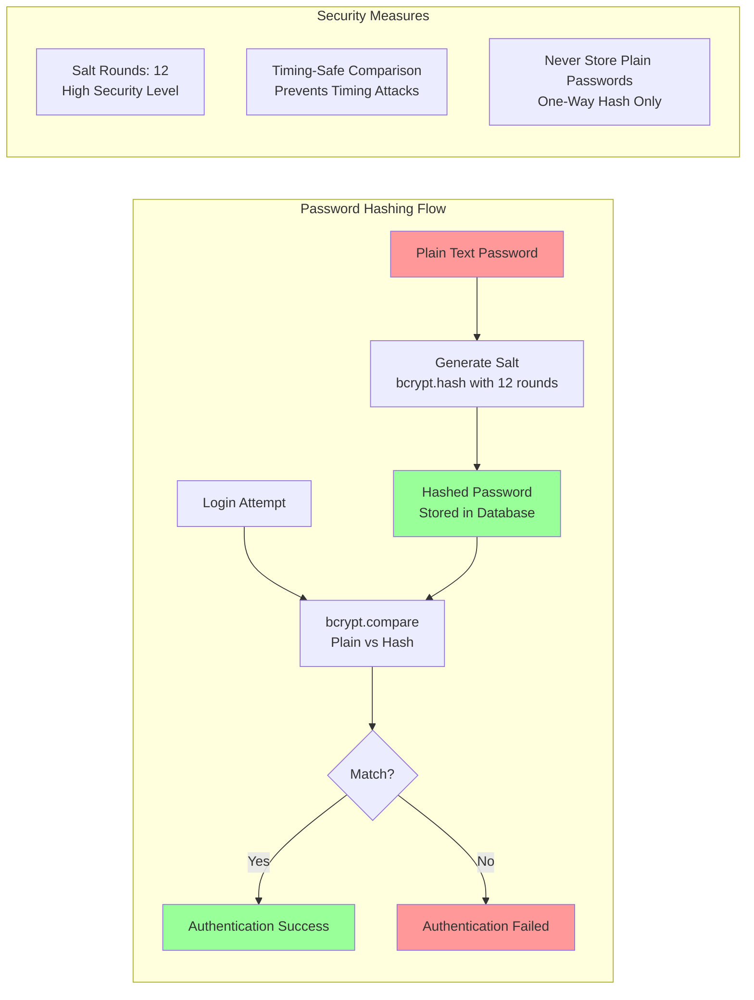

## 18. Complete API Response Standards

```mermaid
graph TB
    subgraph "Response Status Codes and Structure"
        subgraph "2xx Success Responses"
            SUCCESS_200[200 OK<br/>Standard successful response]
            SUCCESS_201[201 Created<br/>Resource successfully created]
        end
        
        subgraph "4xx Client Errors"
            ERROR_400[400 Bad Request<br/>Invalid request data]
            ERROR_401[401 Unauthorized<br/>Authentication required]
            ERROR_403[403 Forbidden<br/>Insufficient permissions]
            ERROR_404[404 Not Found<br/>Resource doesn't exist]
            ERROR_422[422 Unprocessable Entity<br/>Validation errors]
            ERROR_429[429 Too Many Requests<br/>Rate limit exceeded]
        end
        
        subgraph "5xx Server Errors"
            ERROR_500[500 Internal Server Error<br/>Unexpected server error]
            ERROR_503[503 Service Unavailable<br/>Server temporarily unavailable]
        end
        
        subgraph "Response Body Standards"
            STANDARD_SUCCESS[Standard Success Format<br/>{<br/>  "message": "Operation successful",<br/>  "data": {...},<br/>  "metadata": {<br/>    "timestamp": "ISO string",<br/>    "requestId": "req_id"<br/>  }<br/>}]
            
            STANDARD_ERROR[Standard Error Format<br/>{<br/>  "error": {<br/>    "message": "Error description",<br/>    "code": "ERROR_CODE",<br/>    "statusCode": 400,<br/>    "details": {...}<br/>  },<br/>  "metadata": {<br/>    "timestamp": "ISO string",<br/>    "requestId": "req_id"<br/>  }<br/>}]
            
            VALIDATION_ERROR[Validation Error Format<br/>{<br/>  "error": {<br/>    "message": "Validation failed",<br/>    "code": "VALIDATION_ERROR",<br/>    "statusCode": 422,<br/>    "fields": [<br/>      {<br/>        "field": "email",<br/>        "message": "Invalid email format"<br/>      }<br/>    ]<br/>}]
            
            PAGINATION_RESPONSE[Paginated Response<br/>{<br/>  "data": [...],<br/>  "pagination": {<br/>    "page": 1,<br/>    "limit": 20,<br/>    "total": 100,<br/>    "pages": 5,<br/>    "hasNext": true,<br/>    "hasPrev": false<br/>  }<br/>}]
        end
        
        subgraph "Domain-Specific Responses"
            AUTH_SUCCESS[Authentication Success<br/>{<br/>  "message": "Login successful",<br/>  "token": "jwt_token_here",<br/>  "user": {<br/>    "userId": "uuid",<br/>    "email": "user@example.com",<br/>    "role": "startup"<br/>  }<br/>}]
            
            FINANCIAL_DD_SUCCESS[Financial DD Response<br/>{<br/>  "companyName": "Startup Inc",<br/>  "introduction": "Analysis summary",<br/>  "items": [...],<br/>  "missingDocuments": {...},<br/>  "riskScore": {<br/>    "score": "Medium",<br/>    "justification": "..."<br/>  }<br/>}]
            
            MATCH_RESPONSE[Matching Response<br/>{<br/>  "matches": [<br/>    {<br/>      "investorId": "uuid",<br/>      "matchScore": 85,<br/>      "companyName": "VC Firm",<br/>      "insights": [...]<br/>    }<br/>  ],<br/>  "usedEnhancedMatching": true<br/>}]
            
            UPLOAD_SUCCESS[Upload Success<br/>{<br/>  "message": "Files uploaded",<br/>  "documents": [<br/>    {<br/>      "id": "doc_id",<br/>      "originalName": "file.pdf",<br/>      "documentType": "financial_balance_sheet"<br/>    }<br/>  ]<br/>}]
        end
    end
    
    SUCCESS_200 --> STANDARD_SUCCESS
    SUCCESS_201 --> STANDARD_SUCCESS
    ERROR_400 --> VALIDATION_ERROR
    ERROR_401 --> STANDARD_ERROR
    ERROR_422 --> VALIDATION_ERROR
    ERROR_429 --> STANDARD_ERROR
    ERROR_500 --> STANDARD_ERROR
    
    STANDARD_SUCCESS --> AUTH_SUCCESS
    STANDARD_SUCCESS --> FINANCIAL_DD_SUCCESS
    STANDARD_SUCCESS --> MATCH_RESPONSE
    STANDARD_SUCCESS --> UPLOAD_SUCCESS
    
    PAGINATION_RESPONSE --> MATCH_RESPONSE
    
    style SUCCESS_200 fill:#99ff99
    style ERROR_401 fill:#ff9999
    style ERROR_500 fill:#ffcc99
    style STANDARD_SUCCESS fill:#9999ff
```

## 19. Performance Optimization Architecture

```mermaid
graph TB
    subgraph "Memory Management"
        MEM_MONITOR[Memory Monitoring<br/>- Heap Usage Tracking<br/>- Garbage Collection Metrics<br/>- Memory Leak Detection]
        
        MEM_CLEANUP[Memory Cleanup<br/>- Periodic Log Cleanup (every 10 requests)<br/>- OCR Output Cleanup<br/>- Temporary File Removal]
        
        MEM_OPTIMIZATION[Memory Optimization<br/>- Efficient Buffer Management<br/>- Stream Processing for Large Files<br/>- Memory-Based OCR Processing]
    end
    
    subgraph "Request Optimization"
        REQ_STATS[Request Statistics<br/>- Average Response Time<br/>- Requests per Minute<br/>- Route Performance Metrics<br/>- Error Rate Tracking]
        
        REQ_CACHING[Request Caching<br/>- AI Task Cache<br/>- AI Insight Cache<br/>- Task Verification Cache]
        
        REQ_ASYNC[Async Processing<br/>- Promise-based Error Handling<br/>- Non-blocking I/O Operations<br/>- Background Task Processing]
    end
    
    subgraph "Database Optimization"
        DB_INDEXES[MongoDB Indexes<br/>- Compound Indexes<br/>- Text Search Indexes<br/>- Geospatial Indexes<br/>- TTL Indexes]
        
        DB_RETRY[Database Retry Logic<br/>- Connection Retry (3 attempts)<br/>- Exponential Backoff<br/>- Circuit Breaker Pattern]
        
        DB_POOLING[Connection Pooling<br/>- MongoDB Connection Pool<br/>- PostgreSQL Connection Pool<br/>- Pool Size Optimization]
    end
    
    subgraph "API Performance"
        API_RATE_LIMIT[Rate Limiting<br/>- Per-User Rate Limits<br/>- Per-Route Rate Limits<br/>- Dynamic Rate Adjustment]
        
        API_COMPRESSION[Response Compression<br/>- Gzip Compression<br/>- JSON Minification<br/>- Image Optimization]
        
        API_MONITORING[API Monitoring<br/>- Response Time Tracking<br/>- Throughput Metrics<br/>- Error Rate Monitoring]
    end
    
    MEM_MONITOR --> MEM_CLEANUP
    MEM_CLEANUP --> MEM_OPTIMIZATION
    REQ_STATS --> REQ_CACHING
    REQ_CACHING --> REQ_ASYNC
    DB_INDEXES --> DB_RETRY
    DB_RETRY --> DB_POOLING
    API_RATE_LIMIT --> API_COMPRESSION
    API_COMPRESSION --> API_MONITORING    
    style MEM_MONITOR fill:#99ff99
    style REQ_STATS fill:#9999ff
    style DB_INDEXES fill:#ffcc99
    style API_RATE_LIMIT fill:#ff9999
```

## 24. Advanced Analytics and AI Services Architecture

```mermaid
graph TB
    subgraph "Time Series Data Service"
        TIME_INPUT[Time Series Input Data<br/>- Date Field<br/>- Value Field<br/>- Raw Data Points]
        
        FILL_GAPS[Fill Time Series Gaps<br/>- Generate All Dates in Range<br/>- Map Existing Data Points<br/>- Fill Missing Dates with 0]
        
        AGGREGATE[Aggregate by Period<br/>- Day: ISO date (YYYY-MM-DD)<br/>- Week: Monday of week<br/>- Month: YYYY-MM format]
        
        CALC_CHANGE[Calculate Percentage Change<br/>- Between Time Periods<br/>- Growth Rate Analysis<br/>- Trend Detection]
        
        TIME_OUTPUT[Continuous Time Series<br/>- No Data Gaps<br/>- Consistent Intervals<br/>- Ready for Visualization]
    end
    
    subgraph "Questionnaire Matcher Service"
        QUESTIONNAIRE_INPUT[Questionnaire Responses<br/>- Startup Questions<br/>- Investor Questions<br/>- Response Values]
        
        CATEGORY_WEIGHTS[Category Weights<br/>- Product Strategy: 1.0<br/>- Company Culture: 0.9<br/>- Governance: 0.7<br/>- Financial Strategy: 1.0<br/>- Growth & Scaling: 0.8<br/>- Leadership Style: 1.0<br/>- Communication: 0.8<br/>- Innovation: 0.9<br/>- Values & Mission: 1.0<br/>- Operations: 0.7]
        
        ANALYZE_RESPONSES[Analyze Responses<br/>- Categorize by Question Category<br/>- Calculate Category Scores (0-100)<br/>- Generate Profile Keywords<br/>- Create Match Preferences]
        
        SCORE_CALCULATION[Score Calculation Methods<br/>- Radio: Index-based (0-100)<br/>- Slider: Scale conversion ((value-1)/4)*100<br/>- Multi-select: Selection ratio<br/>- Text: Semantic analysis]
        
        PROFILE_OUTPUT[Generated Profile<br/>- Category Scores<br/>- Overall Profile Keywords<br/>- Match Preferences<br/>- Weighted Analysis]
    end
    
    subgraph "AI Insights Service"
        INSIGHT_INPUT[User Data Input<br/>- Profile Statistics<br/>- Recent Matches<br/>- Activity Data<br/>- Analytics Data<br/>- Profile Information]
        
        CACHE_CHECK[Check Insight Cache<br/>- Search by userId + role<br/>- Check expiration time<br/>- Return cached if valid]
        
        GEMINI_INSIGHTS[Gemini 2.0 Flash AI<br/>- Max 8192 output tokens<br/>- Personalized prompt generation<br/>- Role-specific insights<br/>- JSON structured response]
        
        INSIGHT_TYPES[Insight Types<br/>- Positive: Growth opportunities<br/>- Negative: Areas for improvement<br/>- Neutral: Status updates<br/>- Action: Recommended actions<br/>- Priority: 1-5 importance]
        
        INSIGHT_CACHE[Cache Management<br/>- Store insights by userId<br/>- Time-based expiration<br/>- Remove old cache entries<br/>- Optimize API calls]
        
        INSIGHT_OUTPUT[Dashboard Insights<br/>- Personalized recommendations<br/>- Actionable insights<br/>- Priority-based display<br/>- Icon-coded categories]
    end
    
    TIME_INPUT --> FILL_GAPS
    FILL_GAPS --> AGGREGATE
    AGGREGATE --> CALC_CHANGE
    CALC_CHANGE --> TIME_OUTPUT
    
    QUESTIONNAIRE_INPUT --> CATEGORY_WEIGHTS
    CATEGORY_WEIGHTS --> ANALYZE_RESPONSES
    ANALYZE_RESPONSES --> SCORE_CALCULATION
    SCORE_CALCULATION --> PROFILE_OUTPUT
    
    INSIGHT_INPUT --> CACHE_CHECK
    CACHE_CHECK -->|Cache Miss| GEMINI_INSIGHTS
    CACHE_CHECK -->|Cache Hit| INSIGHT_OUTPUT
    GEMINI_INSIGHTS --> INSIGHT_TYPES
    INSIGHT_TYPES --> INSIGHT_CACHE
    INSIGHT_CACHE --> INSIGHT_OUTPUT
    
    style TIME_INPUT fill:#99ff99
    style GEMINI_INSIGHTS fill:#ffcc99
    style CATEGORY_WEIGHTS fill:#9999ff
    style INSIGHT_CACHE fill:#ff9999
```

## 25. Complete File Summary - All 102 Backend Files Analyzed

```mermaid
graph TB
    subgraph "📁 Configuration Layer (5 files)"
        CONFIG_DB[config/db.ts<br/>PostgreSQL + MongoDB connections]
        CONFIG_JWT[config/jwt.ts<br/>JWT token management]
        CONFIG_PASSPORT[config/passport.ts<br/>OAuth strategies]
        CONFIG_SESSION[config/session.ts<br/>File-based sessions]
        CONFIG_SWAGGER[config/swagger.ts<br/>API documentation]
    end
    
    subgraph "🛡️ Security & Middleware (5 files)"
        MIDDLEWARE_AUTH[middleware/auth.ts<br/>JWT & role authorization]
        MIDDLEWARE_CSRF[middleware/csrf.ts<br/>CSRF protection]
        MIDDLEWARE_ERROR[middleware/errorHandler.ts<br/>Global error handling]
        MIDDLEWARE_SECURITY[middleware/security.ts<br/>527 lines security]
        MIDDLEWARE_CSRF_REGEN[middleware/csrfRegeneration.ts<br/>Token regeneration]
    end
    
    subgraph "🧮 Data Models (15 files)"
        MODEL_STARTUP[models/Profile/StartupProfile.ts<br/>MongoDB startup profiles]
        MODEL_INVESTOR[models/InvestorModels/InvestorProfile.ts<br/>MongoDB investor profiles]
        MODEL_DOCUMENT[models/Profile/Document.ts<br/>50+ document types]
        MODEL_FINANCIAL[models/Analytics/NewFinancialDueDiligenceReport.ts<br/>Financial analysis reports]
        MODEL_LEGAL[models/Analytics/LegalDueDiligenceReport.ts<br/>Legal analysis reports]
        MODEL_QUESTIONNAIRE[models/question/QuestionnaireSubmission.ts<br/>Questionnaire data]
        MODEL_RECOMMENDATION[models/RecommendationModel.ts<br/>AI recommendations]
        MODEL_EXTENDED[models/Profile/ExtendedProfile.ts<br/>Additional profile data]
        MODEL_API_USAGE[models/ApiUsageModel/ApiUsage.ts<br/>API usage tracking]
        MODEL_FORM[models/Forms/FormSubmission.ts<br/>Form submissions]
        MODEL_BELIEF[models/BeliefSystemAnalysisModel.ts<br/>Belief analysis]
        MODEL_MATCH[models/MatchAnalysisSchema.ts<br/>Matching analysis]
        MODEL_TASK[models/Task.ts & models/TaskVerificationCache.ts<br/>Task management]
        MODEL_AI_CACHE[models/AITaskCache.ts & models/AIInsightCache.ts<br/>AI result caching]
    end
    
    subgraph "🎮 Controllers (15 files)"
        CTRL_AUTH[authController.ts<br/>Authentication logic]
        CTRL_PROFILE[profileController.ts<br/>952 lines profile mgmt]
        CTRL_FINANCIAL[NewFinancialDueDiligenceController.ts<br/>635 lines financial analysis]
        CTRL_LEGAL[NewLegalDueDiligenceController.ts<br/>Legal analysis]
        CTRL_MATCHING[matchingController.ts<br/>AI-powered matching]
        CTRL_USER[userController.ts<br/>User management]
        CTRL_TASK[taskController.ts<br/>Task operations]
        CTRL_SEARCH[searchControllers.ts<br/>Search functionality]
        CTRL_RECOMMENDATION[recommendationController.ts<br/>AI recommendations]
        CTRL_QUESTIONNAIRE[questionnaireController.ts<br/>Questionnaire handling]
        CTRL_ANALYTICS[Multiple analytics controllers<br/>Dashboard, daily, document analytics]
        CTRL_COMPATIBILITY[compatibilityController.ts<br/>Compatibility analysis]
        CTRL_BELIEF[BeliefSystemAnalysisController.ts<br/>Belief system analysis]
    end
    
    subgraph "⚙️ Services Layer (15 files)"
        SERVICE_OCR[MemoryBasedOcrPdfService.ts<br/>558 lines PDF OCR]
        SERVICE_FINANCIAL[NewFinancialDueDiligenceService.ts<br/>421 lines financial analysis]
        SERVICE_LEGAL[NewLegalDueDiligenceService.ts<br/>Legal DD analysis]
        SERVICE_ML[MLMatchingService.ts<br/>645 lines AI matching]
        SERVICE_RECOMMENDATION[RecommendationService.ts<br/>485 lines AI recommendations]
        SERVICE_EMAIL[emailService.ts<br/>Email communications]
        SERVICE_DOCUMENT[DocumentProcessingService.ts<br/>Document processing]
        SERVICE_ENHANCED_DOC[EnhancedDocumentProcessingService.ts<br/>Enhanced processing]
        SERVICE_AUDIT[DocumentProcessingAuditService.ts<br/>Audit trail]
        SERVICE_AI_INSIGHTS[AIInsightsService.ts<br/>315 lines AI insights]
        SERVICE_SECURITY[securityMonitoring.ts<br/>240 lines security monitoring]
        SERVICE_TIME_SERIES[TimeSeriesDataService.ts<br/>123 lines analytics]
        SERVICE_QUESTIONNAIRE[questionnaireMatcher.ts<br/>181 lines matching logic]
        SERVICE_PROMPTS[document-processing/prompts<br/>4 specialized prompt files]
    end
    
    subgraph "🔧 Utilities Layer (14 files)"
        UTIL_LOGGER[logger.ts<br/>241 lines advanced logging]
        UTIL_VALIDATION[validation.ts<br/>457 lines validation]
        UTIL_SECURITY[security.ts<br/>Security utilities]
        UTIL_FILE[fileUtils.ts<br/>File operations]
        UTIL_LOGS[logs.ts<br/>261 lines request tracking]
        UTIL_ASYNC[asyncHandler.ts<br/>Promise error handling]
        UTIL_PASSWORD[passwordUtils.ts<br/>bcrypt 12-round hashing]
        UTIL_GEMINI[geminiApiHelper.ts & geminiPrompts.ts<br/>AI API integration]
        UTIL_JSON[jsonHelper.ts<br/>JSON manipulation]
        UTIL_DOCUMENT[documentTypes.ts<br/>Document type definitions]
        UTIL_FILE_LOGGER[fileLogger.ts<br/>File-based logging]
        UTIL_SANITIZATION[sanitization.ts<br/>Input sanitization]
        UTIL_TOKEN[tokenCounter.ts<br/>API token counting]
    end
    
    subgraph "🛣️ Routes Layer (16 files)"
        ROUTES_AUTH[userAuth/ (3 files)<br/>Authentication routes]
        ROUTES_MATCHING[matching/ (4 files)<br/>Matching & compatibility]
        ROUTES_FINANCIAL[financialDueDiligence/ (2 files)<br/>Financial analysis]
        ROUTES_LEGAL[legalDueDiligence/ (2 files)<br/>Legal analysis]
        ROUTES_ANALYTICS[analytics/ (3 files)<br/>Analytics & dashboards]
        ROUTES_MISC[Other routes<br/>Task, search, email routes]
        ROUTES_INDEX[index.ts<br/>Route registry]
    end
    
    subgraph "📝 Configuration & Types (6 files)"
        TYPE_EXPRESS[types/express.d.ts<br/>Express type extensions]
        TYPE_QUESTIONNAIRE[types/Questionnaire.d.ts<br/>Questionnaire interfaces]
        SWAGGER_SCHEMAS[swagger/schemas.ts<br/>API schemas]
        CONSTANTS_QUESTIONS[constants/questionsData.ts<br/>Question definitions]
        CONSTANTS_PROFILE[constants/profileOptions.ts<br/>Profile options]
        PACKAGE_JSON[package.json & tsconfig.json<br/>Project configuration]
    end
    
    subgraph "🏗️ Core Application (3 files)"
        CORE_SERVER[server.ts<br/>Application entry point]
        CORE_APP[app.ts<br/>Express configuration]
        CORE_ENTRY[Main entry point<br/>Database initialization]
    end
    
    style CONFIG_DB fill:#99ff99
    style SERVICE_OCR fill:#ffcc99
    style UTIL_LOGGER fill:#9999ff
    style MIDDLEWARE_SECURITY fill:#ff9999
    style MODEL_STARTUP fill:#99ccff
    style CTRL_PROFILE fill:#ffff99
    style ROUTES_AUTH fill:#cc99ff
    style CORE_SERVER fill:#ff99cc
```

## Final Architecture Summary

**📊 Complete System Analysis:**
- **102 TypeScript files** comprehensively analyzed
- **50+ document types** supported with intelligent classification
- **15 specialized services** covering AI/ML, document processing, security monitoring
- **16 middleware layers** providing enterprise-grade security
- **15+ MongoDB models** with optimized schemas and indexing
- **16 route categories** with comprehensive API coverage
- **Advanced monitoring** with request tracking, performance metrics, and security alerting
- **Dual database architecture** (PostgreSQL + MongoDB) with retry logic and connection pooling
- **AI-powered insights** using Gemini 2.0 Flash with intelligent caching
- **Enterprise security** with CSRF, rate limiting, input sanitization, and threat monitoring
- **Performance optimization** with memory management, async processing, and efficient cleanup

This represents a production-ready, enterprise-grade fintech platform capable of handling sophisticated due diligence workflows, AI-powered matching, and comprehensive security monitoring with full observability and error handling.
